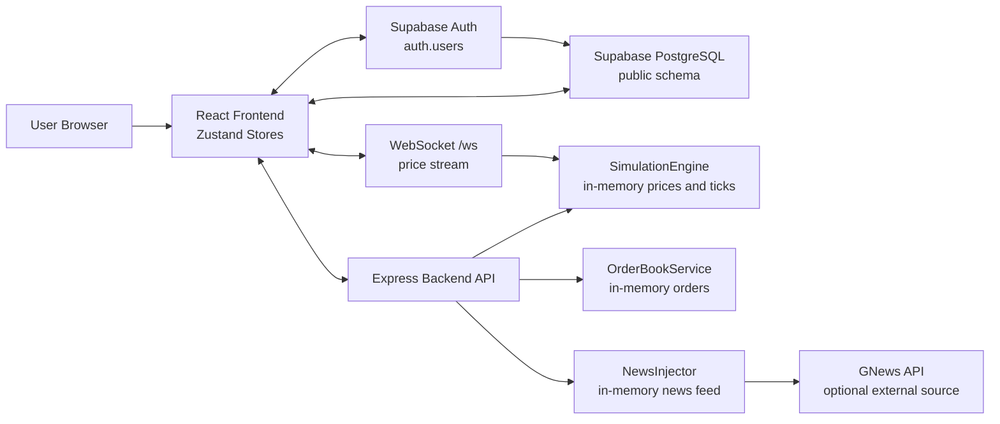
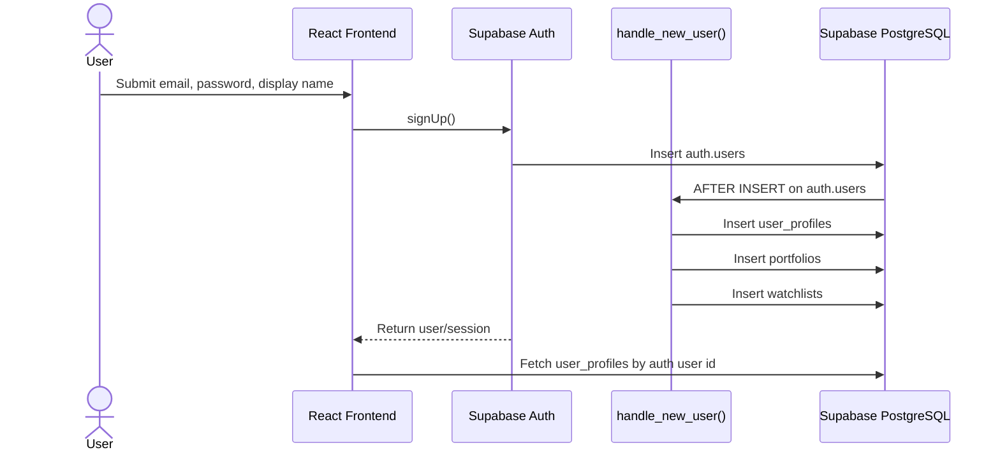
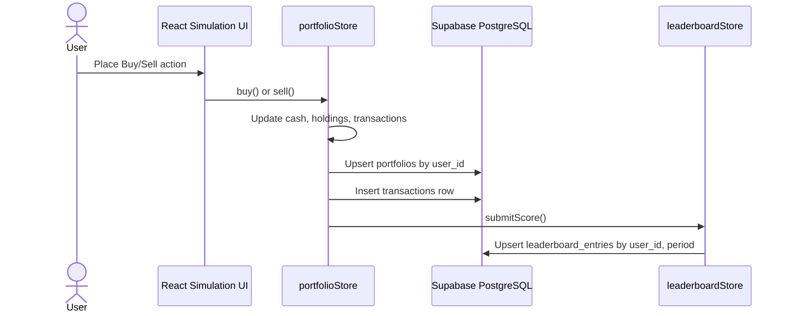
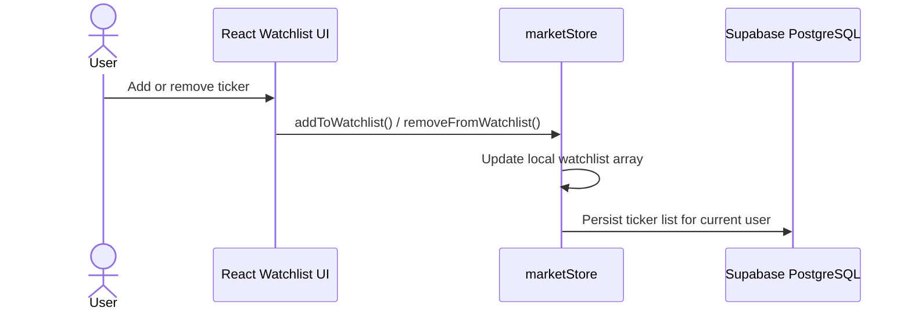
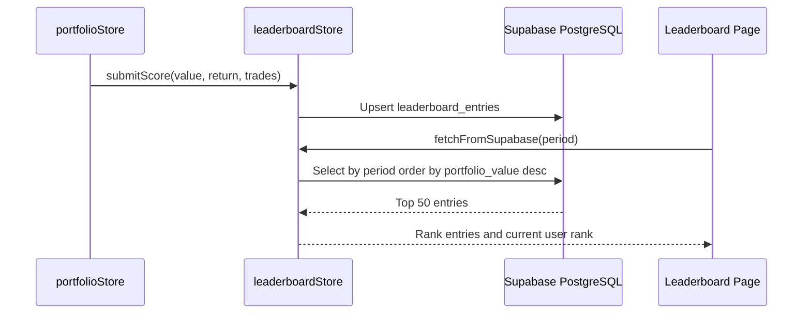
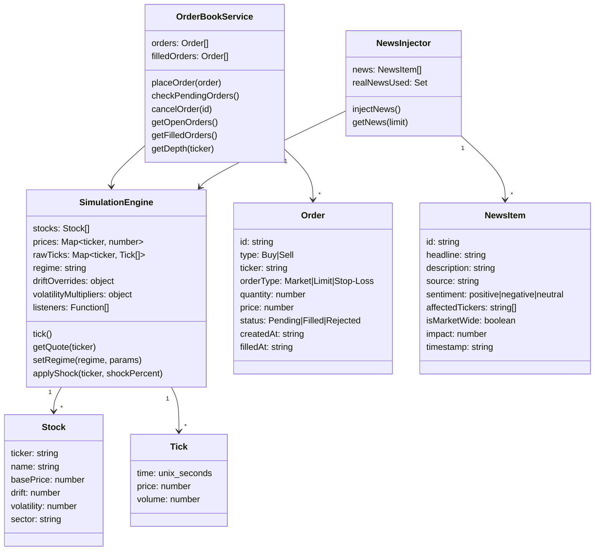
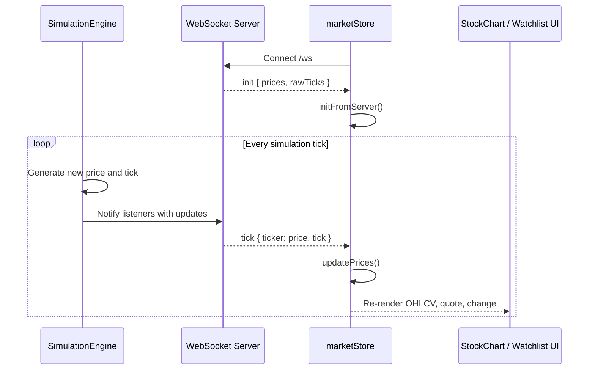
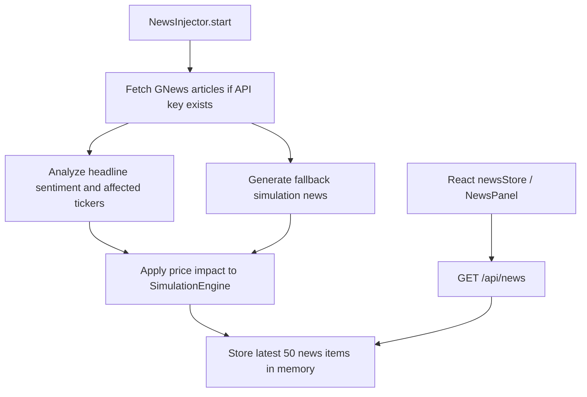

# SoictStock - Data Design

## 1. Scope

Phần này mô tả thiết kế dữ liệu của hệ thống SoictStock theo định dạng Software Design Document. Thiết kế được tổng hợp từ `supabase-schema.sql`, backend Express routes/services và frontend Zustand stores.

Hệ thống có hai nhóm dữ liệu chính:

- **Persistent data**: dữ liệu lâu dài được lưu trong Supabase PostgreSQL, gồm tài khoản người dùng, hồ sơ, portfolio, lịch sử giao dịch, watchlist và leaderboard.
- **Runtime simulation data**: dữ liệu mô phỏng được sinh trong bộ nhớ khi backend/frontend chạy, gồm giá cổ phiếu realtime, tick history, order book, news feed và scenario state.

## 2. Data Architecture Overview



## 3. Persistent Data Model

### 3.1 Entity Relationship Diagram

```mermaid
erDiagram
    AUTH_USERS ||--o| USER_PROFILES : "has profile"
    AUTH_USERS ||--o| PORTFOLIOS : "owns portfolio"
    AUTH_USERS ||--o{ TRANSACTIONS : "executes"
    AUTH_USERS ||--o| WATCHLISTS : "maintains"
    AUTH_USERS ||--o{ LEADERBOARD_ENTRIES : "ranked by period"

    AUTH_USERS {
        UUID id PK
        TEXT email
    }

    USER_PROFILES {
        UUID id PK, FK
        TEXT email
        TEXT display_name
        TEXT avatar_url
        TIMESTAMPTZ created_at
        TIMESTAMPTZ updated_at
    }

    PORTFOLIOS {
        UUID id PK
        UUID user_id FK, UNIQUE
        NUMERIC cash
        NUMERIC initial_cash
        JSONB holdings
        TIMESTAMPTZ updated_at
    }

    TRANSACTIONS {
        UUID id PK
        UUID user_id FK
        TEXT type
        TEXT ticker
        TEXT order_type
        INTEGER quantity
        NUMERIC price
        NUMERIC total
        TEXT status
        TIMESTAMPTZ created_at
    }

    WATCHLISTS {
        UUID id PK
        UUID user_id FK, UNIQUE
        TEXT_ARRAY tickers
        TIMESTAMPTZ updated_at
    }

    LEADERBOARD_ENTRIES {
        UUID id PK
        UUID user_id FK
        TEXT display_name
        NUMERIC portfolio_value
        NUMERIC total_return
        NUMERIC sharpe_ratio
        INTEGER trades_count
        TEXT period
        TIMESTAMPTZ updated_at
    }
```

### 3.2 Table Summary

| Table | Purpose | Persistence |
| --- | --- | --- |
| `auth.users` | Supabase-managed authentication table. | Supabase Auth |
| `user_profiles` | Stores application-level user profile information. | PostgreSQL |
| `portfolios` | Stores each user's cash balance and holdings snapshot. | PostgreSQL |
| `transactions` | Stores executed buy/sell transaction history. | PostgreSQL |
| `watchlists` | Stores the list of tickers followed by each user. | PostgreSQL |
| `leaderboard_entries` | Stores user ranking metrics by period. | PostgreSQL |

## 4. Data Dictionary

### 4.1 `auth.users`

Supabase-managed authentication entity. The application references `auth.users(id)` from all user-owned persistent tables.

| Field | Type | Constraint | Description |
| --- | --- | --- | --- |
| `id` | `UUID` | Primary key | Unique authenticated user id. |
| `email` | `TEXT` | Supabase-managed | User email used for login and profile initialization. |

### 4.2 `user_profiles`

| Field | Type | Constraint | Description |
| --- | --- | --- | --- |
| `id` | `UUID` | PK, FK to `auth.users(id)`, `ON DELETE CASCADE` | Same id as authenticated user. |
| `email` | `TEXT` | `NOT NULL` | User email copied at signup. |
| `display_name` | `TEXT` | `NOT NULL`, default `Trader` | Name displayed in the UI and leaderboard. |
| `avatar_url` | `TEXT` | Nullable | Optional user avatar. |
| `created_at` | `TIMESTAMPTZ` | Default `NOW()` | Profile creation time. |
| `updated_at` | `TIMESTAMPTZ` | Default `NOW()` | Last profile update time. |

### 4.3 `portfolios`

| Field | Type | Constraint | Description |
| --- | --- | --- | --- |
| `id` | `UUID` | PK, default `gen_random_uuid()` | Portfolio record id. |
| `user_id` | `UUID` | FK to `auth.users(id)`, `NOT NULL`, `UNIQUE`, `ON DELETE CASCADE` | Owner of the portfolio. |
| `cash` | `NUMERIC` | `NOT NULL`, default `150000` | Current cash balance. |
| `initial_cash` | `NUMERIC` | `NOT NULL`, default `150000` | Starting cash used to calculate returns. |
| `holdings` | `JSONB` | `NOT NULL`, default `{}` | Holdings map keyed by ticker. |
| `updated_at` | `TIMESTAMPTZ` | Default `NOW()` | Last portfolio sync time. |

Logical JSON shape for `holdings`:

```json
{
  "SCT": {
    "shares": 100,
    "avgPrice": 128.45,
    "realizedPL": 0
  }
}
```

### 4.4 `transactions`

| Field | Type | Constraint | Description |
| --- | --- | --- | --- |
| `id` | `UUID` | PK, default `gen_random_uuid()` | Transaction id. |
| `user_id` | `UUID` | FK to `auth.users(id)`, `NOT NULL`, `ON DELETE CASCADE` | User who made the trade. |
| `type` | `TEXT` | `NOT NULL`, check in `Buy`, `Sell` | Transaction direction. |
| `ticker` | `TEXT` | `NOT NULL` | Stock ticker. |
| `order_type` | `TEXT` | `NOT NULL`, default `Market` | Market, Limit, or Stop-Loss order type. |
| `quantity` | `INTEGER` | `NOT NULL` | Number of shares. |
| `price` | `NUMERIC` | `NOT NULL` | Executed price per share. |
| `total` | `NUMERIC` | `NOT NULL` | `quantity * price`. |
| `status` | `TEXT` | `NOT NULL`, default `Filled` | Execution status. |
| `created_at` | `TIMESTAMPTZ` | Default `NOW()` | Transaction creation time. |

### 4.5 `watchlists`

| Field | Type | Constraint | Description |
| --- | --- | --- | --- |
| `id` | `UUID` | PK, default `gen_random_uuid()` | Watchlist record id. |
| `user_id` | `UUID` | FK to `auth.users(id)`, `NOT NULL`, `UNIQUE`, `ON DELETE CASCADE` | Owner of the watchlist. |
| `tickers` | `TEXT[]` | `NOT NULL`, default core tickers | Followed ticker symbols. |
| `updated_at` | `TIMESTAMPTZ` | Default `NOW()` | Last watchlist update time. |

Default ticker list: `SCT`, `INNO`, `NXTG`, `HEAL`, `GRN`.

### 4.6 `leaderboard_entries`

| Field | Type | Constraint | Description |
| --- | --- | --- | --- |
| `id` | `UUID` | PK, default `gen_random_uuid()` | Leaderboard row id. |
| `user_id` | `UUID` | FK to `auth.users(id)`, `NOT NULL`, `ON DELETE CASCADE` | Ranked user. |
| `display_name` | `TEXT` | `NOT NULL` | Cached display name for leaderboard display. |
| `portfolio_value` | `NUMERIC` | `NOT NULL`, default `150000` | Current portfolio value. |
| `total_return` | `NUMERIC` | `NOT NULL`, default `0` | Return percentage. |
| `sharpe_ratio` | `NUMERIC` | `NOT NULL`, default `0` | Risk-adjusted performance metric. |
| `trades_count` | `INTEGER` | `NOT NULL`, default `0` | Number of executed trades. |
| `period` | `TEXT` | `NOT NULL`, default `weekly`, check in `daily`, `weekly`, `monthly`, `all-time` | Ranking period. |
| `updated_at` | `TIMESTAMPTZ` | Default `NOW()` | Last ranking update time. |

Unique constraint: `UNIQUE(user_id, period)`.

## 5. Persistent Constraints and Indexes

### 5.1 Primary Keys

Each persistent table uses a UUID primary key. `user_profiles.id` is both the primary key and foreign key to `auth.users(id)`.

### 5.2 Foreign Keys

All user-owned records reference `auth.users(id)` with `ON DELETE CASCADE`. When a user is removed, dependent profile, portfolio, transactions, watchlist and leaderboard entries are also removed.

### 5.3 Uniqueness

- `portfolios.user_id` is unique, enforcing one portfolio per user.
- `watchlists.user_id` is unique, enforcing one watchlist per user.
- `leaderboard_entries(user_id, period)` is unique, enforcing one ranking entry per user per period.

### 5.4 Check Constraints

- `transactions.type IN ('Buy', 'Sell')`
- `leaderboard_entries.period IN ('daily', 'weekly', 'monthly', 'all-time')`

### 5.5 Indexes

| Index | Fields | Purpose |
| --- | --- | --- |
| `idx_transactions_user` | `transactions(user_id)` | Fast lookup of a user's transaction history. |
| `idx_transactions_created` | `transactions(created_at DESC)` | Fast chronological transaction feeds. |
| `idx_leaderboard_period` | `leaderboard_entries(period, portfolio_value DESC)` | Fast leaderboard ranking by period and value. |

## 6. Data Security Design

Supabase Row Level Security is enabled for all public persistent tables.

| Table | Read Access | Write Access |
| --- | --- | --- |
| `user_profiles` | User can read own profile. | User can insert/update own profile. |
| `portfolios` | User can read own portfolio. | User can insert/update own portfolio. |
| `transactions` | User can read own transactions. | User can insert own transactions. |
| `watchlists` | User can read own watchlist. | User can insert/update own watchlist. |
| `leaderboard_entries` | Everyone can read leaderboard entries. | User can insert/update own entries. |

RLS ownership is evaluated through `auth.uid()`.

## 7. Data Lifecycle

### 7.1 User Signup Provisioning



### 7.2 Buy/Sell Persistence Flow



### 7.3 Watchlist Persistence Flow



### 7.4 Leaderboard Flow



## 8. Runtime Data Model

Runtime data is not durable by default. It is rebuilt when the server or browser restarts.



## 9. Runtime Market Data Flow



## 10. Runtime News Data Flow



## 11. Data Access Design

| Data Area | Access Path | Source of Truth |
| --- | --- | --- |
| Authentication session | `supabase.auth` from frontend | Supabase Auth |
| User profile | Frontend Supabase client | `user_profiles` |
| Portfolio snapshot | Frontend Supabase client | `portfolios` |
| Transaction history | Frontend Supabase client | `transactions` |
| Watchlist | Frontend Supabase client | `watchlists` intended persistent model |
| Leaderboard | Frontend Supabase client; backend has mock route | `leaderboard_entries` |
| Market prices and ticks | WebSocket and simulation engine | In-memory runtime data |
| Orders before execution | Frontend `orderStore` and backend `OrderBookService` | In-memory runtime data |
| News feed | Backend `NewsInjector`; frontend `newsStore` fallback | In-memory runtime data |
| Scenarios | Constants in frontend/backend | Code-defined configuration |

## 12. Logical Object Models Used by UI

### 12.1 Portfolio State

```json
{
  "cash": 150000,
  "initialCash": 150000,
  "holdings": {
    "SCT": {
      "shares": 100,
      "avgPrice": 128.45,
      "realizedPL": 0
    }
  },
  "transactions": [
    {
      "id": "uuid-or-client-id",
      "type": "Buy",
      "ticker": "SCT",
      "orderType": "Market",
      "quantity": 100,
      "price": 128.45,
      "total": 12845,
      "time": "ISO-8601 timestamp",
      "status": "Filled"
    }
  ]
}
```

### 12.2 Market Tick State

```json
{
  "prices": {
    "SCT": 128.45
  },
  "rawTicks": {
    "SCT": [
      {
        "time": 1710000000,
        "price": 128.45,
        "volume": 1200
      }
    ]
  }
}
```

### 12.3 Leaderboard Entry

```json
{
  "rank": 1,
  "userId": "uuid",
  "name": "Trader",
  "portfolio": 189450.2,
  "return": 26.3,
  "sharpe": 2.45,
  "trades": 142
}
```

## 13. Data Retention and Recovery

Persistent user data is retained in Supabase PostgreSQL until explicitly deleted. Because all application records reference `auth.users(id)` with `ON DELETE CASCADE`, deleting an auth user deletes dependent application data. Supabase-managed backups/restoration are responsible for database-level recovery.

Runtime simulation data is ephemeral:

- Price ticks are generated at startup and updated during runtime.
- Open orders and filled orders in backend memory are lost on backend restart.
- News feed cache is lost on backend restart.
- Client fallback simulation state is lost on page refresh unless synchronized to Supabase.

## 14. Implementation Alignment Notes

The intended persistent data model is defined in `supabase-schema.sql`. Current source code contains several areas that should be aligned before release:

| Area | Current Implementation | Schema Design | Recommended Alignment |
| --- | --- | --- | --- |
| Watchlist sync | `marketStore` reads/writes `user_profiles.watchlist`. | Separate `watchlists` table with `tickers TEXT[]`. | Update frontend to read/write `watchlists.tickers` by `user_id`. |
| Portfolio API | `backend/routes/portfolio.js` uses module-level in-memory portfolio. | `portfolios` table persists user portfolio. | Make backend route user-aware and connect it to Supabase, or keep frontend direct Supabase as source of truth. |
| Leaderboard API | `backend/routes/leaderboard.js` returns mock array. | `leaderboard_entries` table stores rankings by period. | Query Supabase leaderboard entries in backend or remove mock route from persistent path. |
| Leaderboard upsert | One frontend path uses `user_name`, `trade_count`, and conflict `user_id`. | Columns are `display_name`, `trades_count`; unique key is `(user_id, period)`. | Use `leaderboardStore.submitScore()` format consistently. |
| Market history API | `market.js` references `engine.histories`. | Runtime engine stores `rawTicks`. | Return aggregated OHLCV from `rawTicks` or rename runtime field. |
| Orders | Backend `OrderBookService` stores pending/filled orders in memory. | Only filled executions are represented as `transactions`. | Persist executed fills into `transactions`; decide whether open orders require a new persistent `orders` table. |

## 15. Design Rationale

- `auth.users` is kept as the identity root to leverage Supabase authentication and RLS.
- User-owned tables reference `auth.users(id)` directly to simplify ownership checks with `auth.uid()`.
- `portfolios.holdings` uses `JSONB` because holdings are a compact ticker-keyed snapshot and the app usually reads/writes the whole portfolio together.
- `transactions` is normalized as an append-only trade history, which supports audit, history display and metrics calculation.
- `watchlists.tickers` uses `TEXT[]` because a watchlist is a simple ordered list of ticker symbols with one record per user.
- `leaderboard_entries` denormalizes `display_name` and metrics for fast ranking queries.
- Market prices, ticks, generated news and scenario effects are runtime simulation data because they are recreated by the simulation engine and are not currently required for long-term audit.
