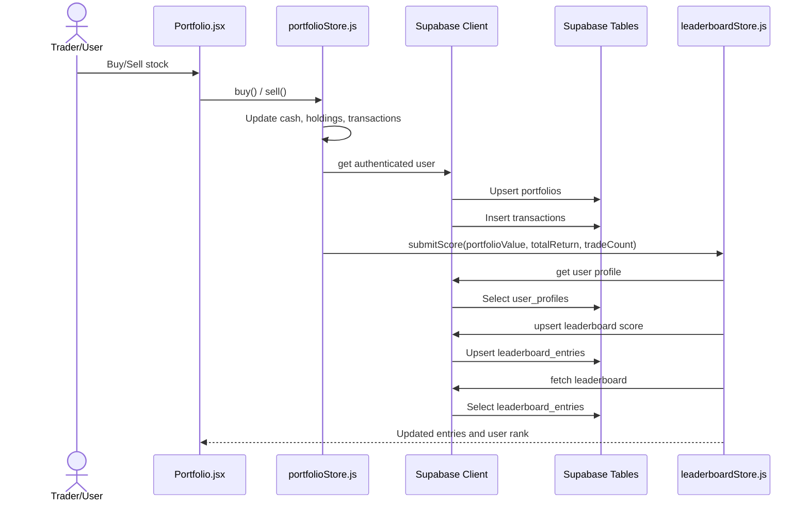

## 1. Sequence Diagram

```mermaid
sequenceDiagram
    actor User as Trader/User
    participant UI as Portfolio.jsx
    participant PS as portfolioStore.js
    participant SC as Supabase Client
    participant DB as Supabase Tables
    participant LS as leaderboardStore.js

    User->>UI: Buy/Sell stock
    UI->>PS: buy() / sell()
    PS->>PS: Update cash, holdings, transactions
    PS->>SC: get authenticated user
    SC->>DB: Upsert portfolios
    SC->>DB: Insert transactions
    PS->>LS: submitScore(portfolioValue, totalReturn, tradeCount)
    LS->>SC: get user profile
    SC->>DB: Select user_profiles
    LS->>SC: upsert leaderboard score
    SC->>DB: Upsert leaderboard_entries
    LS->>SC: fetch leaderboard
    SC->>DB: Select leaderboard_entries
    LS-->>UI: Updated entries and user rank
```

