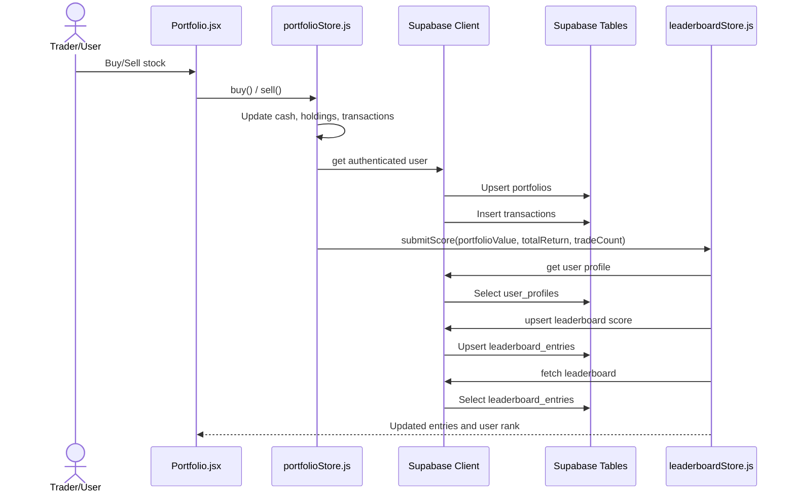
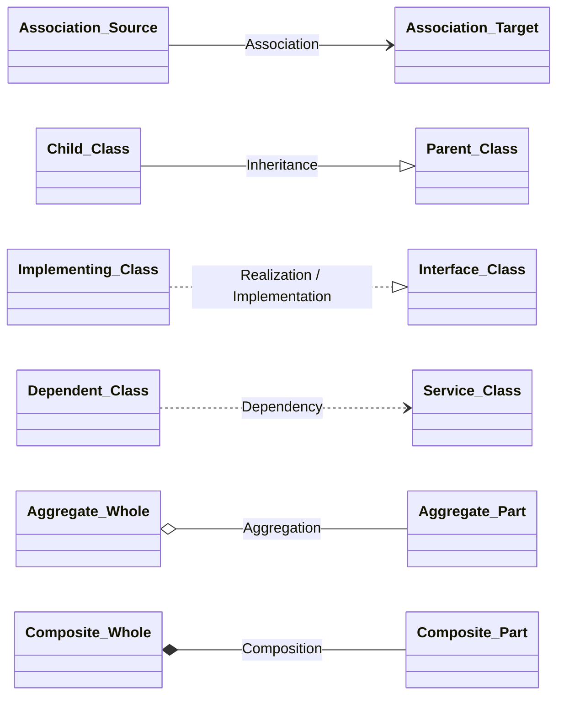
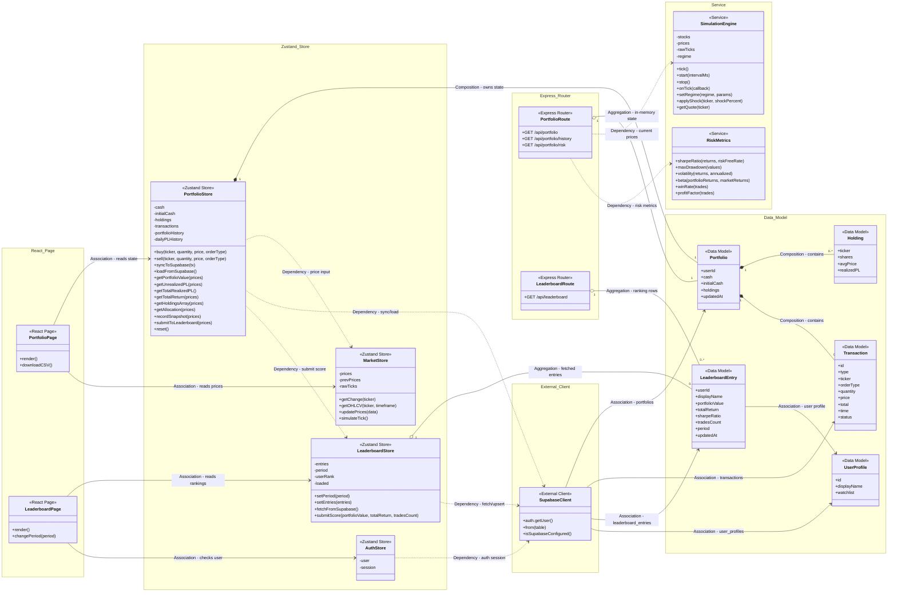

## 1. Sequence Diagram

# Portfolio, Risk, and Leaderboard Component - UML Class Diagram

## UML Relationship Legend

| UML relationship | Mermaid syntax | Meaning |
|---|---:|---|
| Association | `A --> B` | A has a stable structural/use relationship with B. |
| Inheritance | `Child --|> Parent` | Child extends Parent. |
| Realization / Implementation | `Class ..|> Interface` | Class implements Interface. |
| Dependency | `A ..> B` | A temporarily calls or depends on B's API. |
| Aggregation | `A o-- B` | A groups B, but B can exist independently. |
| Composition | `A *-- B` | A strongly owns B as part of its state/lifecycle. |

## Class Diagram

## Notes

- The current source code does not define inheritance or interface implementation relationships for this component, so those arrows are shown only in the legend.
- `Composition` is used where the object is part of the owning state, such as `Portfolio` containing `Holding` and `Transaction`.
- `Aggregation` is used where a class groups data that can exist independently, such as `LeaderboardStore` grouping `LeaderboardEntry`.
- `Dependency` is used for API/service calls, such as `PortfolioStore` calling `SupabaseClient` or `RiskMetrics`.
